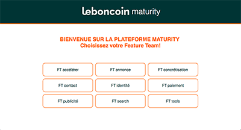
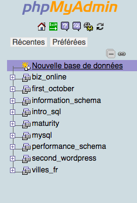
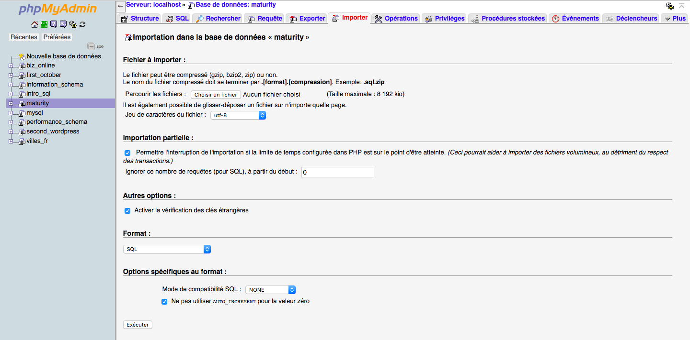

# Team Maturity
Le team Maturity Framework est un outil destiné à l'auto-évaluation des équipes techniques (feature teams) sur trois catégories de critères : 
les process, la qualité, et la valeur fournie à l’utilisateur.

Il est composé d'une série de 49 questions anxquelles les membres d'une même équipe peuvent répondre ensemble.
Les résultats sont ensuite comparables aux résultats des précédentes campagnes de réponses.

## Contexte

Ce projet a été réalisé durant un stage en entreprise en septembre/octobre 2018. 
Le besoin d'un outil d'évaluation avait été constaté lors d'un workshop courant 2018.

## Auteures

Elsa Bougrier - https://github.com/elsaBou 

Elisa Hery - https://github.com/ElisaHery

## Développement

Ce projet a été développé en ReactJS / NodeJS / MySQL.

## Contenu

La page home regroupe le nom des feature teams, chaque équipe possède son propre espace.



La page board permet aux équipes de débuter une nouvelle campagne, de reprendre une campagne commencée 
mais non terminée, ou de consulter ses résultats.


Lorsque la feature team n’a pas de campagne en cours, au clic sur “démarrer une campagne” une page pop-up s’affiche, laissant à l’équipe le choix du nom de la campagne. 
Un clic sur le bouton valider mène vers la page thème. 

La page thème regroupe trois boutons correspondant aux trois chapitres Process, Qualité, Valeur. 
Un clic sur un des chapitres mène à la page des questions. 


La page questionnaire affiche toutes les questions relatives au chapitre sélectionné. 
Cette page permet de visualiser le nombre de questions du chapitre et une icône check 
s’affiche lorsque l’équipe a déjà répondu à une question. 


Une seconde pop-up s’affiche lorsque l’équipe clique sur la question auquelle elle souhaite répondre, 
laissant apparaître la question sous forme de lien cliquable menant vers le site corporate, 
deux radio button pour répondre à la question ainsi qu’une espace permettant de laisser un commentaire. 
Lorsque l’équipe valide la question, la pop-up se referme et l’équipe retourne sur la page questionnaire. 


## Utiliser Team Maturity

### Prérequis
Pour utiliser l'outil Team Maturity vous devez avoir installé phpMyAdmin sur votre système. Pour ce faire :

1) Installez Apache, PHP et MySQL sur votre système grace aux packages suivants :

Windows : http://www.wampserver.com/  --  Mac : https://www.mamp.info/en/ -- linux : https://doc.ubuntu-fr.org/lamp 

2) téléchargez phpMyAdmin depuis cette page : https://www.phpmyadmin.net/ 

## Installation
L'installation se déroule en trois étapes :

1) cloner le repository dans votre système

```` 
git clone https://github.com/ElisaHery/maturity_v1.git 
````

2) Installez la base de données sur phpMyAdmin

Dans phpMyAdmin, créez une nouvelle base de données appelée "maturity".



Importez le fichier "database.sql"




Puis inscrivez votre mot de passe vers phpMyAdmin dans le fichier “database.js”, ligne 6.

3) installation des modules

Depuis le terminal, placez vous dans le dossier racine et tapez la commande suivante :

````
npm install
````

4) Lancement de l’app

Toujours dans le dossier racine, lancez la commande suivante :

````
yarn dev
````

L'outil est lancé!


## Changelog: 

Les possibles améliorations à apporter à l’outil :

1 - Ajouter des icônes check sur la page thème qui indiqueront si toutes les questions d’un chapitre on déjà été répondues. 

2 - Afficher les dates des anciennes campagnes sur la page des résultats ainsi que sur la page board. 

3 - Mettre en relief les résultats indiquant une évolution positive et une évolution négative


