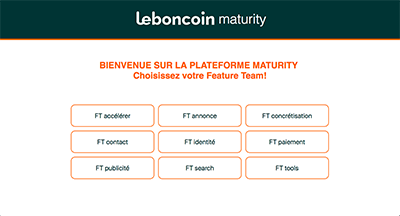
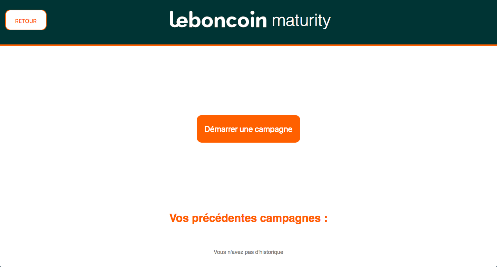
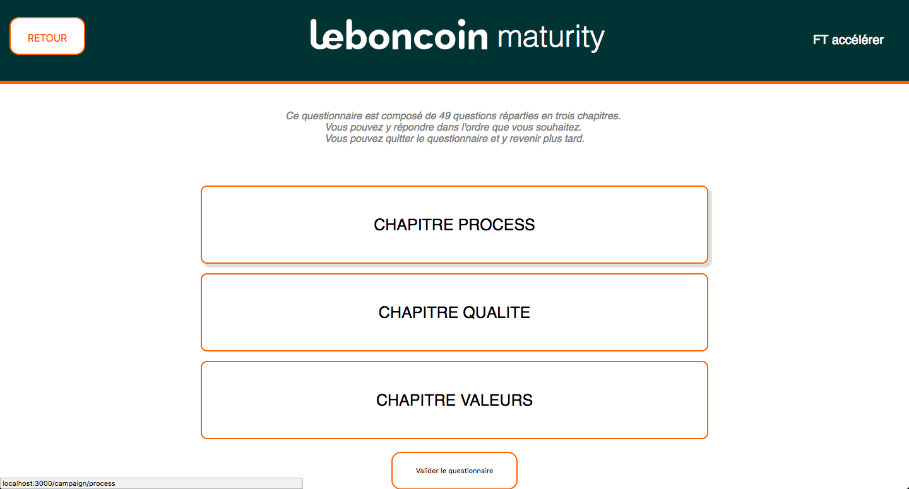
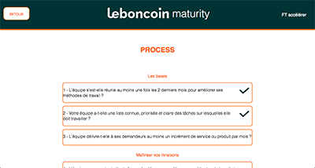
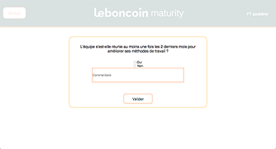
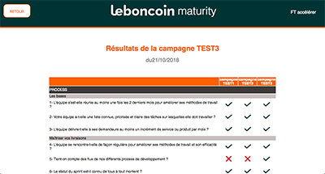

# Team Maturity
Le team Maturity Framework est un outil destiné à l'auto-évaluation des équipes techniques (feature teams) sur trois catégories de critères : 
les process, la qualité, et la valeur fournie à l’utilisateur.

Il est composé d'une série de 49 questions auxquelles les membres d'une même équipe peuvent répondre ensemble.
Les résultats sont ensuite comparables aux résultats des précédentes campagnes de réponses.

## Contexte

Ce projet a été réalisé durant un stage en entreprise en septembre/octobre 2018. 
Le besoin d'un outil d'évaluation avait été constaté lors d'un workshop courant 2018.

## Auteures

Elsa Bougrier ([GitHub](https://github.com/elsaBou) - [LinkedIn](https://www.linkedin.com/in/elsa-bougrier-296677138/) )
 &&  Elisa Hery ([GitHub](https://github.com/ElisaHery) -  [LinkedIn](https://www.linkedin.com/in/elisa-hery-425a58108/))

## Développement

Ce projet a été développé en [React.JS](https://reactjs.org/ReactJS) / [NodeJS](https://nodejs.org/en/NodeJS) /  [mySQL](https://www.mysql.com/fr/MySQL)

## Contenu

La page home regroupe le nom des feature teams, chaque équipe possède son propre espace.





La page board permet aux équipes de débuter une nouvelle campagne, de reprendre une campagne commencée 
mais non terminée, ou de consulter ses résultats.





Lorsque la feature team n’a pas de campagne en cours, au clic sur “démarrer une campagne” une page pop-up s’affiche, laissant à l’équipe le choix du nom de la campagne. 
Un clic sur le bouton valider mène vers la page thème. 

La page thème regroupe trois boutons correspondant aux trois chapitres Process, Qualité, Valeur. 
Un clic sur un des chapitres mène à la page des questions. 





La page questionnaire affiche toutes les questions relatives au chapitre sélectionné. 
Cette page permet de visualiser le nombre de questions du chapitre et une icône check 
s’affiche lorsque l’équipe a déjà répondu à une question. 





Une seconde pop-up s’affiche lorsque l’équipe clique sur la question auquelle elle souhaite répondre, 
laissant apparaître la question sous forme de lien cliquable menant vers le site corporate.





La page des résultats permet de comparer les résultats de différentes campagnes de questions:




## Utiliser Team Maturity

### Prérequis

Pour utiliser l'outil TeamMaturity en local vous devez installer globalement [NodeJS](https://nodejs.org/en/NodeJS), [Yarn](https://yarnpkg.com/en/Yarn) et [mySQL](https://www.mysql.com/fr/MySQL) dans votre système.


### Installation
L'installation se déroule en quatre étapes :

1) cloner le repository dans votre système

```` 
git clone https://github.com/ElisaHery/maturity_v1.git 
````

2) Installer la base de données

Importez le fichier database.sql dans notre système de gestion de base de données (phpMyAdmin par exemple).

N'oubliez pas de changer les informations relatives à la base de données dans le fichier “database.js”.

````
const mysql = require("mysql");

const connection = mysql.createConnection({
  host: "localhost",
  user: "********",
  password: "********",
  database: "maturity"
});
````

3) installer les modules

Depuis le terminal, placez vous dans le dossier racine et tapez la commande suivante :

````
npm install
````

4) Lancer l’app

Toujours dans le dossier racine, lancez la commande suivante :

````
yarn dev
````

L'outil est lancé!


## Pistes de progrès: 

Liste non exhaustive des possibles améliorations à apporter à l’outil :

1 - Ajouter des icônes check sur la page thème qui indiqueront si toutes les questions d’un chapitre ont déjà été répondues.

2 - Mettre les boutons radios directement à côté des questions pour éviter l'ouverture d'une popup à chaque question. Ajouter une icône pour déployer la zone de texte si l'équipe veut ajouter un commentaire.

3 - Afficher les dates des anciennes campagnes sur la page des résultats ainsi que sur la page board. 

4 - Présence d’un bug sur la page des questions, obligeant à rafraîchir la page sinon l’icône de la question ne s’affiche pas. 

5 - Sur la page des résultats, si l'équipe a ajouté un commentaire en répondant, le signifier d'une façon ou d'une autre, etle rendre disponible au survol.

6 - Mettre en relief les résultats indiquant une évolution positive et une évolution négative


